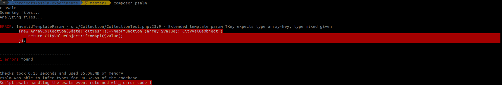

# psalm-experiments

When I running `composer psalm` I get an error:

In `src/Collection/CollectionTest.php` file I have two methods. One (`withPsalmErrors`) throw an error like on the image above.
The second (`withoutPsalmErrors`) is correct and doesn't give psalm errors (but it required to create extra variable). Maybe 
there is a better solution to achieve a similar result? 